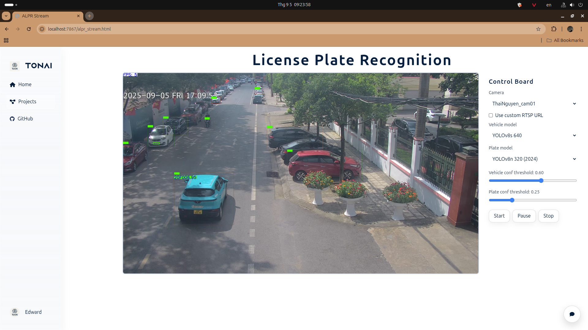

# TrafficCam: Traffic surveillance
### Demo pipeline result

### Web App (beta)


## ToDo
- [ ] MLOPs Platform
- [x] PPOCRv5 (Detection + Orientation + Recognition)
- [x] TensorRT Inference
- [x] ONNX Models
- [x] PPOCRv4 (Detection + Recognition)
- [x] DeepSort Tracking 
- [x] Plate Detection
- [x] Vehicle Detection

## Prerequisite
* Ubuntu 20.04 or later
* 3.12 >= Python version >= 3.9

## Overview
**Update 11st August 2025**: PPOCRv5 and an Web App (beta version) for testing

**Update 5th July 2024**: PPOCRv4 is added. Text detection is also added to improve performance for plates in different perspectives

**Update 1st Nov 2023**: DeepSORT is replaced by SORT to speed up the flow. In addition, TensorRT inference and code for model conversion have been added.

Both vehicle and plate detector based on the YOLOv8 model, please checkout the official repository [Ultralytics](https://github.com/ultralytics/ultralytics) to install environment for inference as well as training.

For instant usage, there are two trained model for both detection tasks are put in the ```weights``` folder (You may have to check the default path in code). You can train Ultralytics YOLO on your custom dataset via the CLI using `scripts/train_yolov8.sh` or `python detectors/ultralytic_yolo/train_ultralytics.py`.

As regards plate recognition, [PaddleOCR](https://github.com/PaddlePaddle/PaddleOCR) is used to recognized the plate information. Currently, it is run by ONNXRuntime with TensorRT Execution Provider backend.

For tracking task, DeepSORT algorithm is implemented. The pretrained model are taken from [John1liu](https://github.com/John1liu/YOLOV5-DeepSORT-Vehicle-Tracking-Master).

Some robust objects detector are in the research progress, they'll come soon :relaxed:

## Usage
<!-- Clone this repository
```bat
git clone https://github.com/tungedng2710/license-plate-recognition.git
cd license-plate-recognition
``` -->
Install required libraries
```bat
bash scripts/install.sh
```

For inference on a single video, run script below
```bat
python main.py --video [path_to_your_video] [optional arguments]
```
**Arguments**
- ```--video```: (str) path to video, ```0``` for webcam
- ```--save```: (bool) save output video
- ```--save_dir```: (str) saved path
- ```--vehicle_weight```: (str) path to the yolov8 weight of vehicle detector
- ```--plate_weight```: (str) path to the yolov8 weight of plate detector
- ```--vconf```: (float) confidence for vehicle detection
- ```--pconf```: (float) confidence for plate detection
- ```--ocrconf_thres```: (float) threshold for ocr model
- ```--stream```: (bool): real-time monitoring
- ```--read_plate```: (bool): Use for plate recognition, disable it if you want to count vehicles only.

As regards streaming control, from keyboard, 
- ```Q```: exit the running window
- ```R```: to reset object tracker (equivalent to re-count number of entire vehicles from that time)
- ```P```: pause video

For quick testing
```bat
python test_alpr.py --input_source <path to your image/video>
```

## Train Ultralytics YOLO
Train a detector directly from the CLI without editing Python files:

```bash
# Bash wrapper
./scripts/train_yolo.sh \
  --data data/Peru_License_Plate/data.yaml \
  --model yolov8n.yaml \
  --epochs 200 --batch 16 --imgsz 320 --device 0

# Or call the script with Python
python detectors/ultralytic_yolo/train_ultralytics.py \
  --data data/Peru_License_Plate/data.yaml \
  --model yolov8n.yaml --epochs 200 --batch 16 --imgsz 320 --device 0
```

Arguments (common):
- `--data`: path to `data.yaml` (e.g., `data/LP-11k/data.yaml`).
- `--model`: YOLOv8 config or weights (e.g., `yolov8n.yaml`, `yolov8s.pt`).
- `--epochs`, `--batch`, `--imgsz`: training hyperparameters.
- `--device`: CUDA device id(s) or `cpu`.
- `--project`, `--name`, `--exist-ok`, `--workers`, `--resume`, `--patience`, `--seed`.

## TonAI Computer Vision Hub
Launch a modern interface for starting YOLOv9 training with live progress updates:

```bash
pip install -r requirements.txt
uvicorn webapp.backend.main:app --reload
```

Open `http://localhost:8000` in your browser to configure the run, select datasets, and watch training progress.

## Docker
Build and run the web application in a container:
```bash
docker compose up --build
```
This command starts the FastAPI service on [http://localhost:8000](http://localhost:8000),
running from the repository root.

To build and run the image manually:
```bash
docker build -t trafficcam .
docker run -p 8000:8000 trafficcam
```
