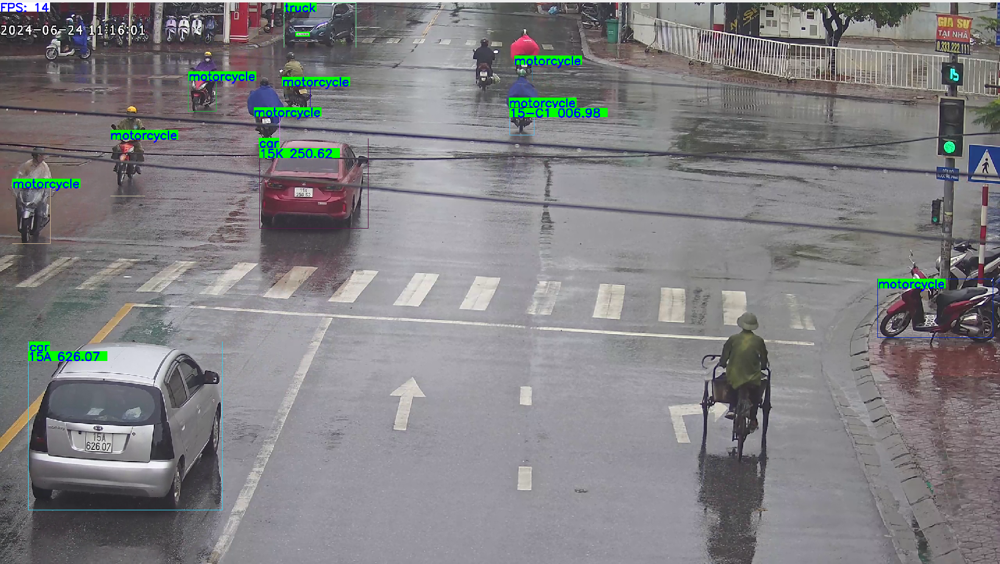

# TrafficCam: Traffic surveillance

## ToDo
- [x] TensorRT Inference
- [x] ONNX Models
- [x] PPOCRv4 (Detection + Recognition)
- [x] DeepSort Tracking 
- [x] Plate Detection
- [x] Vehicle Detection

## Prerequisite
* Ubuntu 20.04 or later
* 3.10 >= Python version >= 3.7

## Overview
**Update 5th July 2024**: PPOCRv4 is added. Text detection is also added to improve performance for plates in different perspectives
**Update 1st Nov 2023**: DeepSORT is replaced by SORT to speed up the flow. In addition, TensorRT inference and code for model conversion have been added.

Both vehicle and plate detector based on the YOLOv8 model, please checkout the official repository [Ultralytics](https://github.com/ultralytics/ultralytics) to install environment for inference as well as training.

For instant usage, there are two trained model for both detection tasks are put in the ```weights``` folder (You may have to check the default path in code). In addition, you can train the yolov8 with your custom dataset with several lines of code in the ```detectors/yolov8/train_yolov8.py``` file.

As regards plate recognition, [PaddleOCR](https://github.com/PaddlePaddle/PaddleOCR) is used to recognized the plate information. Currently, it is run by ONNXRuntime with TensorRT Execution Provider backend.

For tracking task, DeepSORT algorithm is implemented. The pretrained model are taken from [John1liu](https://github.com/John1liu/YOLOV5-DeepSORT-Vehicle-Tracking-Master).

Some robust objects detector are in the research progress, they'll come soon :relaxed:

## Usage
<!-- Clone this repository
```bat
git clone https://github.com/tungedng2710/license-plate-recognition.git
cd license-plate-recognition
``` -->
Install required libraries
```bat
bash scripts/install.sh
```
For quick inference on all videos in a folder, run 
```bat
bash run.sh
```
For quick inference on all videos in a folder, run 
```bat
bash scripts/run_folder.sh
```

The result would be saved in the directory ```data/log```, you can change the saved path by changing the ```--save_dir``` argument.

For inference on a single video, run script below
```bat
python main.py --video [path_to_your_video] [optional arguments]
```
**Arguments**
- ```--video```: (str) path to video, ```0``` for webcam
- ```--save```: (bool) save output video
- ```--save_dir```: (str) saved path
- ```--vehicle_weight```: (str) path to the yolov8 weight of vehicle detector
- ```--plate_weight```: (str) path to the yolov8 weight of plate detector
- ```--vconf```: (float) confidence for vehicle detection
- ```--pconf```: (float) confidence for plate detection
- ```--ocrconf_thres```: (float) threshold for ocr model
- ```--stream```: (bool): real-time monitoring
- ```--read_plate```: (bool): Use for plate recognition, disable it if you want to count vehicles only.

As regards streaming control, from keyboard, 
- ```Q```: exit the running window
- ```R```: to reset object tracker (equivalent to re-count number of entire vehicles from that time)
- ```P```: pause video

### Web UI for YOLOv9 training
To launch a simple interface for starting YOLOv9 training:

```bash
cd webapp
pip install -r requirements.txt
uvicorn backend.main:app --reload
```

Open `http://localhost:8000` in your browser to configure and start training.
